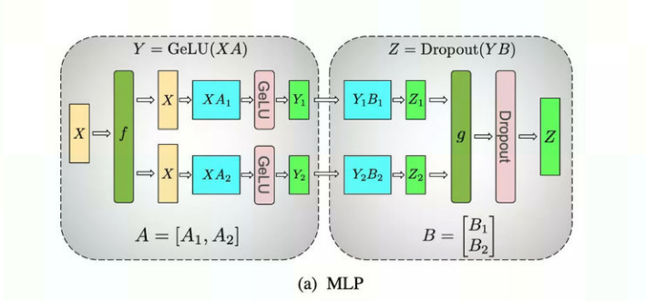

##模型并行策略的简要介绍

### 解决的痛点问题
模型并行策略是大规模分布式训练很常见的一种策略，如果模型中参数非常多，单个device的内存无法支撑模型的运行时，模型并行策略可以有效的解决这个问题。它将模型中的特定子图中的参数均匀的分配到若干个device上，每个device进行部分计算，然后通过allreduce获取所有卡的参数，从而达到获取完整输出的目标。
模型并行策略的要求是：

### 适用的场景
模型并行是算子层面的并行，因此主要适用于：
- 可以并行计算的算子
- 其中一个输入来自于权值
综上， 模型并行中最主要应用的算子就是matmul算子。（conv算子也满足上述要求，不知道为啥没用，个人猜测可能是CNN网络规模不是很大，单卡可以cover, 没必要进行模型并行）

  
#### 场景1：MLP
MLP的网络结构如下图
-TBD

**代码如下：**
```
# x是输入， w1和w2是训练的权值
out1 = torch.matmul(x, w1)
out2 = torch.matmul(out1, w2)
```

**拆分的策略：**
将第一个权值w1按列等分成mp_size份， 第二个权值w2按行等分成mp_size份。每个device保存w1和w2的其中一份。
示例图如下：



**MLP模型并行的demo**
```
import os
import torch
import torch_mlu
import torch.distributed as dist
from torch.multiprocessing import Process

def mlp_on_one_process(x, w1, w2):
    out1 = torch.matmul(x, w1)
    out2 = torch.matmul(out1, w2)
    print(f"in mlp_on_one_process , out is {out2}")

def mlp_by_model_parallel(x, w1, w2):
    out1 = torch.matmul(x, w1)
    out2 = torch.matmul(out1, w2)
    dist.all_reduce(out2, dist.ReduceOp.SUM)
    print(f"+++ rank is: {dist.get_rank()}, out3: {out2}")


def init_process(rank, size, x, w1, w2):
    torch.mlu.set_device(rank)
    os.environ['MASTER_ADDR'] = '127.0.0.1'
    os.environ['MASTER_PORT'] = '29501'
    dist.init_process_group(backend, rank=rank, world_size=size)

    partitioned_w_len = int(w1.shape[1]/size)
    x = x.to("mlu")
    narrowed_w1 = w1[:, (rank*partitioned_w_len):(rank+1)*partitioned_w_len].to("mlu")
    narrowed_w2 = w2[(rank*partitioned_w_len):(rank+1)*partitioned_w_len, :].to("mlu")

    mlp_by_model_parallel(x, narrowed_w1, narrowed_w2)


def mlp_demo_by_model_parallel(mp_size, x, w1, w2):
    processes = []
    for rank in range(mp_size):
        p = Process(target=init_process, args=(rank, mp_size, x, w1, w2))
        p.start()
        processes.append(p)

    for p in processes:
        p.join()


if __name__ == "__main__":
    # configure size of the model
    mp_size = 8
    len_a = 2
    len_b = 4
    len_c = 2*mp_size # must be mp_size times
    len_d = 8 # must be mp_size times
    backend = "cncl"

    #init input
    x = torch.randn(len_a, len_b)
    w1 = torch.randn(len_b, len_c)
    w2 = torch.randn(len_c, len_d)

    mlp_on_one_process(x, w1, w2)
    mlp_demo_by_model_parallel(mp_size, x, w1, w2)

```

#### 场景2：self-attention
仔细观察self-attention的子图，发现其就是两组MLP结构的组合。
self-attention网络的结构如下图
（下图对self-attention子图做了简化，只保留了matmul相关的算子，删除了多头MultiHead等代码。）
TBD

**代码如下：**
```
query = F.linear(x, w_q) # query.shape: [bs,s,h]
key = F.linear(x, w_k)
value = F.linear(x, w_v)

attention_scores = torch.matmul(query, key.permute(0,2,1)) # attention_scores.shape: [bs,s,s]
context_layer = torch.matmul(attention_scores, value) # context_layer.shape: [bs,s,h]
output = F.linear(context_layer, w_o) # output.shape: [bs,s,h]
```

**拆分策略：**
w_q和w_v和MLP中的w1定位相同，按列等分成mp_size份，w_k和w_o和MLP中的w2定位相同。按行等分成mp_size份。
示例图如下：


**self-attention模型并行的demo：**
```
import os
import torch
import torch_mlu
import torch.distributed as dist
import torch.nn.functional as F
from torch.multiprocessing import Process


def self_attention_on_single_process(x, w_q, w_k, w_v, w_o):
    query = F.linear(x, w_q) # query.shape: [bs,s,h]
    key = F.linear(x, w_k)
    value = F.linear(x, w_v)

    attention_scores = torch.matmul(query, key.permute(0,2,1)) # attention_scores.shape: [bs,s,s]
    context_layer = torch.matmul(attention_scores, value) # context_layer.shape: [bs,s,h]
    output = F.linear(context_layer, w_o) # output.shape: [bs,s,h]
    print(f"in simple_self_attention, output is {output}")

def mp_self_attention(x, wq, wk, wv, wo):
    out_q = F.linear(x, wq) #out_q.shape: [bs,s,h/mp]
    out_k = F.linear(x, wk)
    out_v = F.linear(x, wv)
    attention_scores = torch.matmul(out_q, out_k.permute(0,2,1))  # attention_scores: [bs,s,s]
    dist.all_reduce(attention_scores, dist.ReduceOp.SUM)
    context_layer = torch.matmul(attention_scores, out_v)  # attention_scores: [bs,s,h/mp]

    output = F.linear(context_layer, wo) #output.shape: [bs, s, h]
    dist.all_reduce(output, dist.ReduceOp.SUM)
    if dist.get_rank() == 1:
        print(f"+++ rank is: {dist.get_rank()}, out: {output}")


def init_process(rank, size, x, w_q, w_k, w_v, w_o):
    torch.mlu.set_device(rank)
    os.environ['MASTER_ADDR'] = '127.0.0.1'
    os.environ['MASTER_PORT'] = '29501'
    dist.init_process_group(backend, rank=rank, world_size=size)

    partitioned_qkv_len = int(w_q.shape[0]/mp_size)
    x = x.to("mlu")
    narrowed_wq = w_q[rank*partitioned_qkv_len:(rank+1)*partitioned_qkv_len, :].to("mlu") # narrowed_wq.shape: [bs, h, h/mp]
    narrowed_wk = w_k[rank*partitioned_qkv_len:(rank+1)*partitioned_qkv_len, :].to("mlu")
    narrowed_wv = w_v[rank*partitioned_qkv_len:(rank+1)*partitioned_qkv_len, :].to("mlu")
    narrowed_wo = w_o[:, rank*partitioned_qkv_len:(rank+1)*partitioned_qkv_len].to("mlu")

    mp_self_attention(x, narrowed_wq, narrowed_wk, narrowed_wv, narrowed_wo)


def self_attention_demo_by_model_parallel(mp_size, x, w_q, w_k, w_v, w_o):
    processes = []
    for rank in range(mp_size):
        p = Process(target=init_process, args=(rank, mp_size, x, w_q, w_k, w_v, w_o))
        p.start()
        processes.append(p)

    for p in processes:
        p.join()


if __name__ == "__main__":
    # configure model parameters
    mp_size = 8
    bs = 2 # batch_size
    s = 16 # seq_len
    h = 3*mp_size# hidden_size, must be mp_size times
    backend = "cncl"

    # init input_data
    x =   torch.randn(bs, s, h)
    w_q = torch.randn(h, h)
    w_k = torch.randn(h, h)
    w_v = torch.randn(h, h)
    w_o = torch.randn(h, h)
    
    self_attention_on_single_process(x, w_q, w_k, w_v, w_o)
    self_attention_demo_by_model_parallel(mp_size, x, w_q, w_k, w_v, w_o)

```
经过实践， 如果输入相同， 单进程demo和模型并行的多进程demo得到的结果是完全相同的（当然，由于计算累积会带来很小的计算误差，低于0.1%）


### 优缺点

**优点**
- 每张卡保存的权值减少，可以大幅减少训练模型消耗的内存。
- 在模型中实现，不依赖第三方框架平台。大规模分布式训练的另外两种策略：ZeRO数据并行和流水并行。由于其实现的复杂性。它们分别需要借助DeeSpeed和Megatron来实现。而模型并行策略只需要原先的模型中修改即可。减少了学习第三方平台的成本。

**缺点**
- 针对特定的子图结构才生效， 不通用。ZeRO数据并行和流水并行是两种通用的大规模分布式训练的策略，适用于任何模型。而模型并行是一种广泛应用于Transformer类网络中策略，且仅适用于其中的Self-Attention和MLP结构，其他网络暂时无法使用。
- 需要保存多份checkpoint。由于模型并行中每个device只保存部分的权值，因此每张卡的权值都需要保存下来。即需要保存mp_size份checkpoint。

